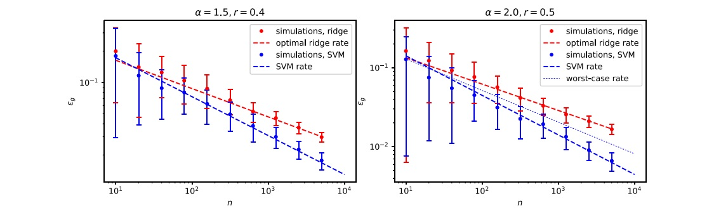

# Kernel_class_g3m

Code for the paper : <i>Error scaling laws for kernel classification under source and capacity conditions</i> (<a href="https://iopscience.iop.org/article/10.1088/2632-2153/acf041/meta">link to paper</a>)

<b>SVM classification</b> (Figs. 1 & 3)
- <tt>maxmargin_simus.ipynb</tt> contains the code used to run max-margin classification experiments on Gaussian synthetic data, satisfying the source and capacity conditions (8).
- <tt>hinge_repl.py</tt> implements the theoretical characterization (13) for the misclassification error $\epsilon_g$.

<b>Ridge classification</b> (Figs. 2 & 3)
- <tt>CV_l2_simus.ipynb</tt> contains the code used to run the ridge classification experiments on Gaussian synthetic data, satisfying the source and capacity conditions (8).
- <tt>hinge_repl.py</tt> implements the theoretical characterization (17) for the misclassification error $\epsilon_g$.

<b>Real data experiments</b> (Figs. 3)  
The code implementing ridge (resp. SVM) classification on real data is provided in <tt>Real_l2.ipynb</tt> (resp. <tt>Real_mm.ipynb</tt>), from data stored in a --datasets/ folder.

<u> Versions:</u> These notebooks employ <tt>Python 3.12 </tt>, and <tt>Pytorch 2.5</tt>.
